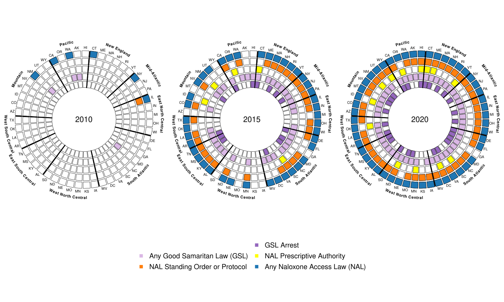
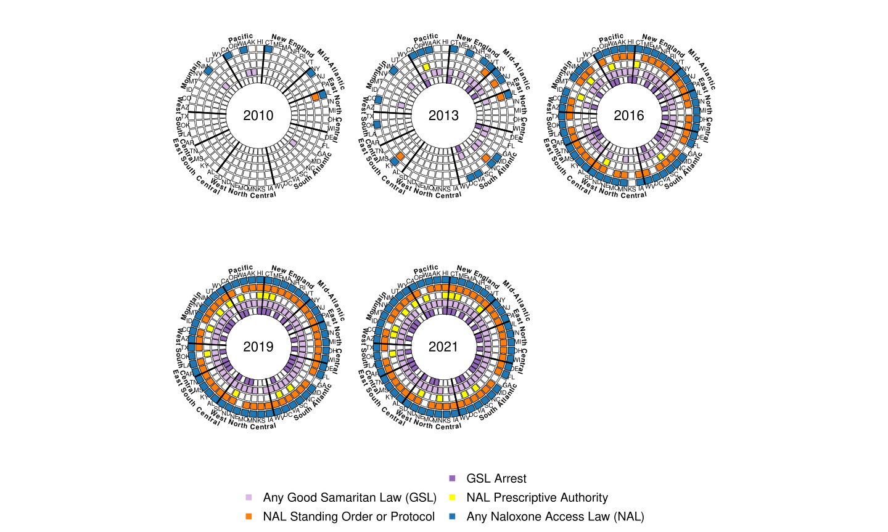
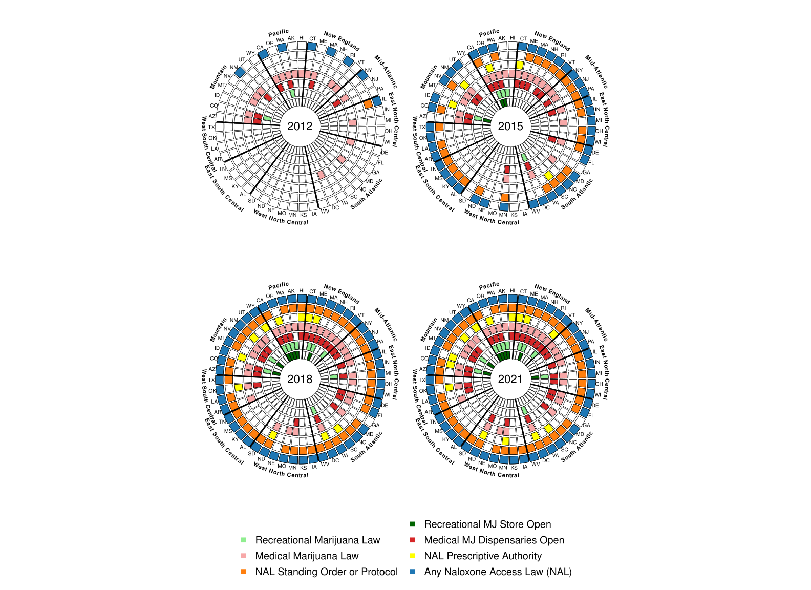
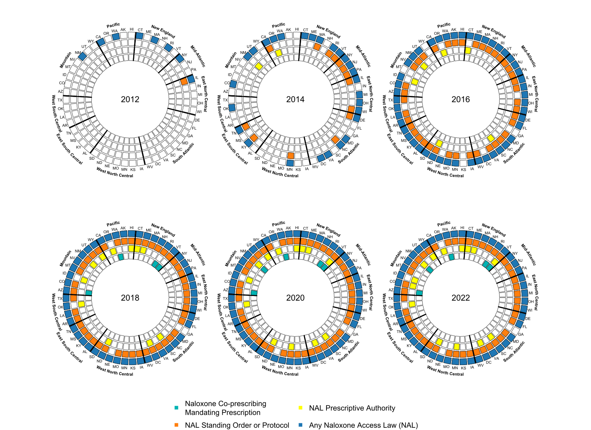

Policy Wheel Tutorial
================
Joshua Eagan, Max Griswold, Beth Ann Griffin, Seema (Choksy) Pessar,
Rosalie Pacula, Bradley Stein
2024-05-10

# Introduction

This tutorial demonstrates the creation of OPTIC style policy wheel data
visualizations. These graphs are meant to illustrate the timeline over
which state level policies are implemented concurrently. For some
examples of these data visualizations, skip to the middle of this
tutorial.

------------------------------------------------------------------------

# Setup

To create one of these graphs, you first need to load in a few R
packages:

- `circlize` (Gu, Z., 2014)
- `data.table` (Srinivasan, 2023)
- `plyr` (Grolemund, 2011)
- `lubridate` (Grolemund, 2011)

You also need to load in the appropriate functions from this project’s
working directory- we did this below using `source`.

``` r
# loading packages

suppressPackageStartupMessages(library(circlize))
library(data.table)
library(plyr)
library(lubridate)

# loading functions
for(file in list.files("R")){
  cat(paste0(file, "\n") )
  source(paste("R", file, sep="/"))
}
```

    ## fill_in_cells.R
    ## make_policy_wheel.R
    ## plot_policy_wheel_internal.R

The R function we use to plot policy wheels is `plot_policy_wheels`.

------------------------------------------------------------------------

# Plotting Policy wheels

Next, you need to load in your data. In the code below, we load in a
wide version of the data, meaning that there is one row for each state
and a column for each policy, containing the date each policy was
implemented for each state. Next, we rename columns in the wide data so
variables are named with the text we want displayed in the graphs.

``` r
# reading in a data frame where rows are states, columns are policies, and values are enactment dates

# Dates can come in the forms: "1/15/2015", "2015-01-15", "2015", or "January 15, 2015"
df_wide <- read.csv('Data/processed/example_data_wide.csv')
names(df_wide) = gsub("\\.", " ", names(df_wide))

# renaming variables
names(df_wide)[names(df_wide) == "nal_date_any_nal"] = "Any Naloxone Access Law (NAL)"
names(df_wide)[names(df_wide) == "nal_date_nal_protocol_standing"] = "NAL Standing Order or Protocol"
names(df_wide)[names(df_wide) == "nal_date_nal_Rx_prescriptive_auth"] = "NAL Prescriptive Authority"

# All NAL laws and GSL
names(df_wide)[names(df_wide) == "gsl_date_anygsl"] = "Any Good Samaritan Law (GSL)"
names(df_wide)[names(df_wide) == "gsl_date_gsl_arrest"] = "GSL Arrest"

# NAL laws and Medical/rec cannabis access 
names(df_wide)[names(df_wide) == "mm_date_effMML"] = "Medical Marijuana Law"
names(df_wide)[names(df_wide) == "mm_date_active_medlegdisp"] = "Medical MJ Dispensaries Open"
names(df_wide)[names(df_wide) == "mm_date_effREC"] = "Recreational Marijuana Law"
names(df_wide)[names(df_wide) == "mm_date_active_dispREC"] = "Recreational MJ Store Open"

# Co-prescribing
names(df_wide)[names(df_wide) == "copnal_date_all_prescribe"] = "Naloxone Co-prescribing\nMandating Prescription"

# looking at the data
head(df_wide)
```

    ##   X state obbt_date_counseling obbt_date_doselimit obbt_date_clincontact
    ## 1 1    AK                 <NA>                <NA>                  <NA>
    ## 2 2    AL                 <NA>                <NA>                  <NA>
    ## 3 3    AR                 <NA>                <NA>                  <NA>
    ## 4 4    AZ                 <NA>                <NA>                  <NA>
    ## 5 5    CA                 <NA>                <NA>                  <NA>
    ## 6 6    CO                 <NA>                <NA>                  <NA>
    ##   Any Naloxone Access Law (NAL) NAL Standing Order or Protocol
    ## 1                    2016-04-01                     2016-04-01
    ## 2                    2015-07-01                     2015-07-01
    ## 3                    2015-08-01                     2015-08-01
    ## 4                    2016-09-01                     2016-09-01
    ## 5                    2008-01-01                     2014-01-01
    ## 6                    2013-06-01                     2015-04-01
    ##   NAL Prescriptive Authority Any Good Samaritan Law (GSL) GSL Arrest
    ## 1                       <NA>                   2008-09-08       <NA>
    ## 2                       <NA>                   2015-06-10       <NA>
    ## 3                       <NA>                   2015-07-22 2015-07-22
    ## 4                       <NA>                   2018-04-26       <NA>
    ## 5                       <NA>                   2013-01-01 2013-01-01
    ## 6                 2021-09-01                   2012-05-29 2016-08-10
    ##   copnal_date_eff_nalcop copnal_date_eff_all pdmp_date_AnyPDMP
    ## 1                   <NA>                <NA>        2008-09-07
    ## 2             2018-09-02                <NA>        2004-08-01
    ## 3                   <NA>                <NA>        2011-03-11
    ## 4             2018-04-26          2018-04-26        2007-09-19
    ## 5             2019-01-01          2019-01-01        1939-01-01
    ## 6             2017-11-30                <NA>        2005-06-03
    ##   pdmp_date_Any_PMP_Horowitz pdmp_date_Op_PDMP pdmp_date_mustaccess
    ## 1                 2008-09-01        2012-01-01                 <NA>
    ## 2                 2005-11-01        2006-04-01                 <NA>
    ## 3                 2013-03-01        2013-05-01                 <NA>
    ## 4                 2007-09-01        2008-12-01                 <NA>
    ## 5                 1990-01-01        2009-09-01                 <NA>
    ## 6                 2005-06-01        2008-02-01                 <NA>
    ##   pdmp_date_electronic Medical Marijuana Law Recreational Marijuana Law
    ## 1           2008-09-07            1999-03-02                 2015-02-24
    ## 2           2004-08-01                  <NA>                       <NA>
    ## 3           2011-07-27            2016-11-09                       <NA>
    ## 4           2007-09-19            2010-12-14                       <NA>
    ## 5           1998-01-01            1996-11-06                 2016-11-09
    ## 6           2005-06-03            2000-12-28                 2012-12-10
    ##   mm_date_meddisp_leg Medical MJ Dispensaries Open Recreational MJ Store Open
    ## 1                <NA>                         <NA>                 2016-10-01
    ## 2                <NA>                         <NA>                       <NA>
    ## 3          2016-11-09                         <NA>                       <NA>
    ## 4          2010-12-14                   2012-12-06                       <NA>
    ## 5          2004-01-01                   2004-01-01                 2018-01-01
    ## 6          2010-07-01                   2010-06-07                 2014-01-01
    ##   Naloxone Co-prescribing\nMandating Prescription
    ## 1                                            <NA>
    ## 2                                            <NA>
    ## 3                                            <NA>
    ## 4                                      2018-04-26
    ## 5                                            <NA>
    ## 6                                            <NA>

Once the data are clean, you can run `plot_policy_wheels` to make your
graph.

``` r
# generating policy wheels
plot_policy_wheels(data = df_wide,
                   
                   # Ordering policies by name:
                  policies = c("Any Naloxone Access Law (NAL)", "NAL Standing Order or Protocol", "NAL Prescriptive Authority", "Any Good Samaritan Law (GSL)", "GSL Arrest"),
                  
                  # name of the state variable
                  state_var = "state",
                  
                  # Restrict to relevant policy intervals, for locations that implemented the policy
                  policy_intervals = c(2010, 2015, 2020),
                  plot_colors = c("#1f77b4", "#ff7f0e", "#FFFF00", "#dab8e5", "#9467bd"),
                  legend_args = list(x = "center", xjust = 0.5, y.intersp = 1.3, x.intersp = 1.3, cex = 2.5, pt.cex = 2.7, bty = "n", ncol = 2),
                  
                  panel_width = 4,
                  panel_height = 5,
                  
                  # where should the graph be saved?
                  out_file = "www/policy_wheel_1.svg")
```

    ## [1] 2010

    ## [1] 2015

    ## [1] 2020

``` r
# displaying the new graph

```

<!-- -->

Referencing the graph, you can see that the ordering of the `policies`
argument corresponds to the ordering of `plot_colors`. The policy
enactment dates in `df` were converted to years and split across 3
separate wheels according to `policy_intervals`. There is an interesting
amount of variation in the “in-between” years (2011-2014 and 2016-2019)-
so increasing the amount of years displayed might better illustrate
these trends. You can see an example of this change below.

``` r
# generating policy wheels
plot_policy_wheels(data = df_wide,
                   
                   # Ordering policies by name:
                  policies = c("Any Naloxone Access Law (NAL)", "NAL Standing Order or Protocol", "NAL Prescriptive Authority", "Any Good Samaritan Law (GSL)", "GSL Arrest"),
                  
                  # name of the state variable
                  state_var = "state",
                  
                  # Restrict to relevant policy intervals, for locations that implemented the policy
                  policy_intervals = c(2010, 2013, 2016, 2019, 2021),
                  plot_colors = c("#1f77b4", "#ff7f0e", "#FFFF00", "#dab8e5", "#9467bd"),
                  legend_args = list(x = "center", xjust = 0.5, y.intersp = 1.3, x.intersp = 1.3, cex = 2.5, pt.cex = 2.7, bty = "n", ncol = 2),
                  
                  panel_width = 4,
                  panel_height = 5,
                  
                  nrows = 2,
                  ncols = 3,
                  
                  # where should the graph be saved?
                  out_file = "www/policy_wheel_1_revised.svg")
```

    ## [1] 2010

    ## [1] 2013

    ## [1] 2016

    ## [1] 2019

    ## [1] 2021

``` r
# displaying the new graph

```

<!-- -->

If you are making your own plots, you can also edit the following
settings:

- `plot_width` and `plot_height`: these edit the dimensions of the plot
  output and will need to be adjusted according to your needs.
- `legend_args`: this is a list whose elements will be passed to
  `graphics::legend()`. Within the function, two arguments are already
  configured for you, `legend` and `col`, but it’s up to you to
  configure the remaining. The defaults are probably fine here, but if
  you want to change anything, refer to `?graphics::legend`.

See another example of a policy wheel below:

``` r
# generating policy wheels
plot_policy_wheels(data = df_wide,
                   
                   # Ordering policies by name:
                  policies = c("Any Naloxone Access Law (NAL)", "NAL Standing Order or Protocol", "NAL Prescriptive Authority",
                    "Medical Marijuana Law", "Medical MJ Dispensaries Open", "Recreational Marijuana Law", "Recreational MJ Store Open"),
                  
                  # name of the state variable
                  state_var = "state",
                  
                  # Restrict to relevant policy intervals, for locations that implemented the policy
                  policy_intervals = c(2012, 2015, 2018, 2021),
                  plot_colors = c("#1f77b4", "#ff7f0e", "#FFFF00", 
                                  "#f7a8a8", "#d62728", "#90EE90","#006400"),
                  legend_args = list(x = "center", xjust = 0.5, y.intersp = 1.3, x.intersp = 1.3, cex = 2.5, pt.cex = 2.7, bty = "n", ncol = 2),
                  
                  plot_width = 22, 
                  plot_height = 16,
                  
                  nrows = 2,
                  ncols = 2,
                  panel_width = 5,
                  panel_height = 6,
                  
                  # where should the graph be saved?
                  out_file = "www/policy_wheel_2.svg")
```

    ## [1] 2012

    ## [1] 2015

    ## [1] 2018

    ## [1] 2021

``` r
# displaying the new graph

```

<!-- -->

In this example, we include data for 7 policies at 4 time points in 3
year intervals. Also, note that the `nrows` and `ncols` arguments were
used to control the layout of the wheels. The result is a bit crowded,
and we would recommend including fewer than 7, or even 6 policies in one
of these plots. We can infer that most states effected a Naloxone Access
Law (NAL) between 2012 and 2015 (blue). Many of these laws allowed the
distribution of Naloxone through a standing or protocol order (orange),
but most states did not pass laws allowing pharmacists prescriptive
authority (yellow) until later. We can also see that the states in the
West and North-East tended to pass these policies across the board
earlier than states in the Midwest and South. Also notice that medicinal
(red) and recreational (green) marijuana laws were passed around the
same time (if not slightly after) NAL in many states.

Lastly, create a plot that shows the association between the passage of
NAL laws and Naloxone Co-prescribing Laws that mandate prescribing and
affect all patients.

``` r
# generating policy wheels
plot_policy_wheels(data = df_wide,
                   
                   # Ordering policies by name:
                  policies = c("Any Naloxone Access Law (NAL)", "NAL Standing Order or Protocol", "NAL Prescriptive Authority",
                    "Naloxone Co-prescribing\nMandating Prescription"),
                  
                  # name of the state variable
                  state_var = "state",
                  
                  # Restrict to relevant policy intervals, for locations that implemented the policy
                  policy_intervals = c(2012, 2014, 2016, 2018, 2020, 2022),
                  plot_colors = c("#1f77b4", "#ff7f0e", "#FFFF00", 
                                  "#00b3b3"),
                  legend_args = list(x = "center", xjust = 0.5, y.intersp = 1.3, x.intersp = 1.3, cex = 2.5, pt.cex = 2.7, bty = "n", ncol = 2),
                  
                  plot_width = 22, 
                  plot_height = 16,
                  
                  panel_width = 5,
                  panel_height = 6,
                  
                  # where should the graph be saved?
                  out_file = "www/policy_wheel_3.svg")
```

    ## [1] 2012

    ## [1] 2014

    ## [1] 2016

    ## [1] 2018

    ## [1] 2020

    ## [1] 2022

``` r
# displaying the new graph

```

<!-- -->

------------------------------------------------------------------------

# Sources:

- Gu, Z. circlize implements and enhances circular visualization in R.
  Bioinformatics 2014.
- Garrett Grolemund, Hadley Wickham (2011). Dates and Times Made Easy
  with lubridate. Journal of Statistical Software, 40(3), 1-25. URL
  <https://www.jstatsoft.org/v40/i03/>
- Dowle M, Srinivasan A (2023). *data.table: Extension of `data.frame`*.
  R package version 1.14.8,
  <https://CRAN.R-project.org/package=data.table>
- Hadley Wickham (2011). The Split-Apply-Combine Strategy for Data
  Analysis. Journal of Statistical Software, 40(1), 1-29. URL
  <https://www.jstatsoft.org/v40/i01/>.
