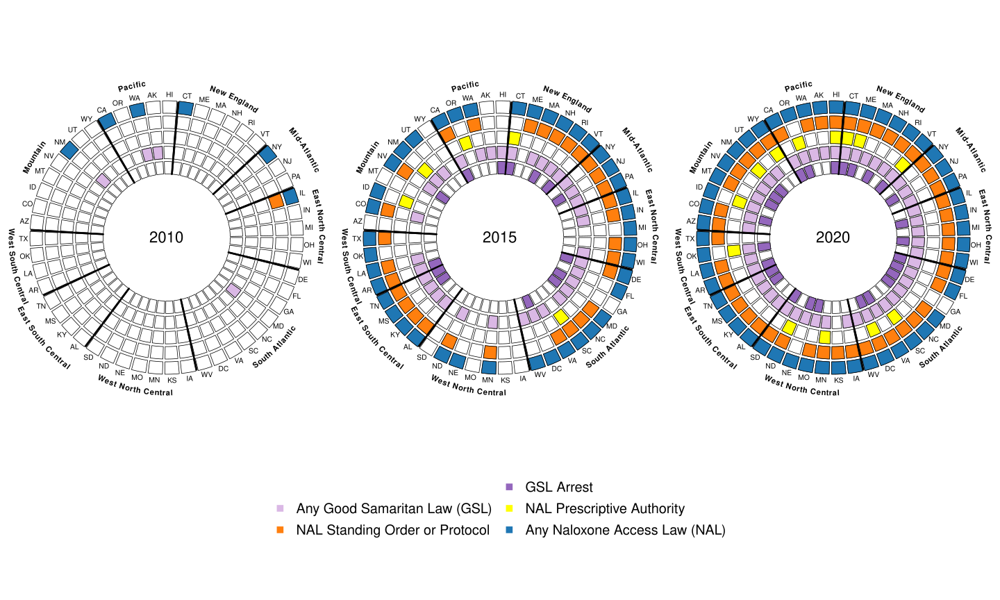
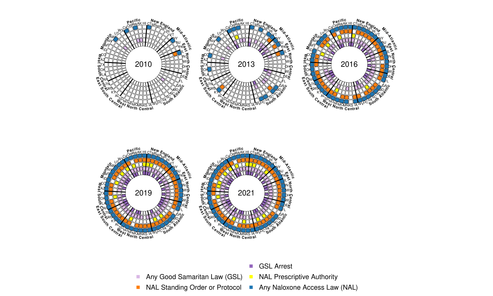
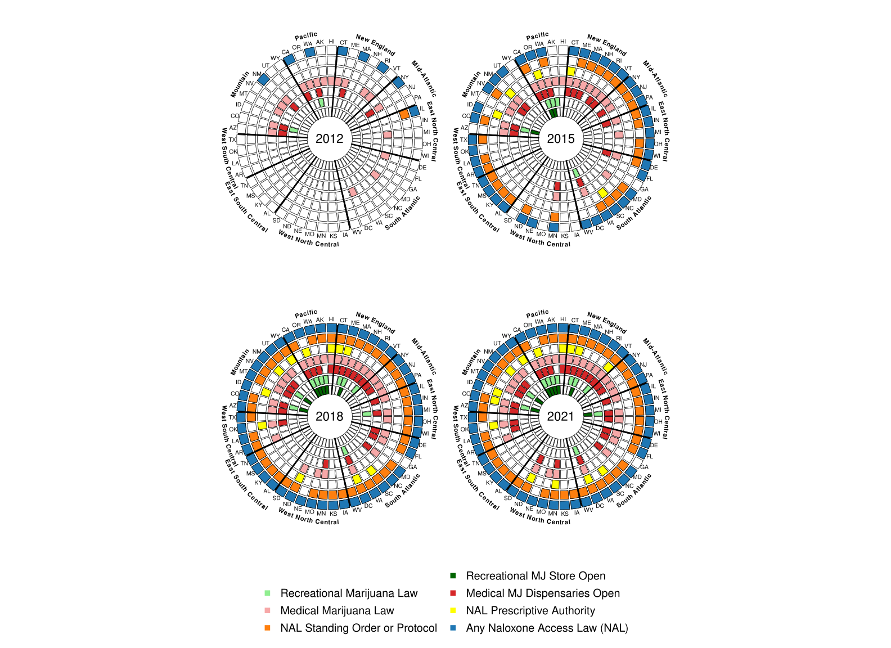
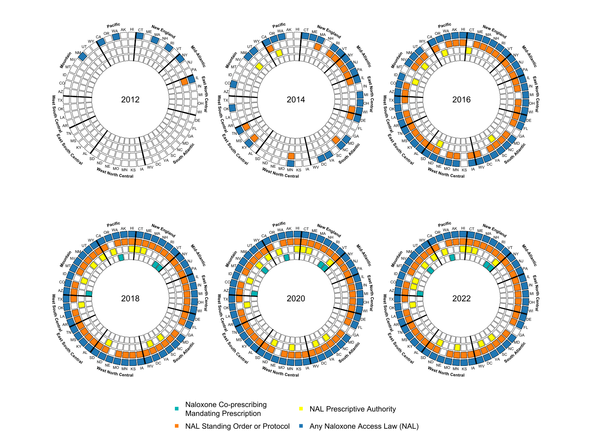

```{r setup, include=FALSE}
knitr::opts_chunk$set(echo = TRUE, warning = FALSE)
```

# Introduction

This tutorial demonstrates the creation of Opioid Policy Tools and Information Center (OPTIC)-style policy wheel data visualizations. These graphs are meant to illustrate the timeline over which multiple state-level policies are implemented. For some examples of these data visualizations, skip to the middle of this tutorial.

-------------------------------------------

# Setup

To create one of these graphs, you first need to load in a few R packages: 

* `circlize` (Gu et al., 2014)
* `data.table` (Dowle andSrinivasan, 2023)
* `plyr` (Grolemund and Wickham, 2011)
* `lubridate` (Grolemund and Wickham, 2011)

You also need to load in the appropriate functions from this project's working directory—we did this below using `source`.


```{r message=FALSE}

# loading packages
suppressPackageStartupMessages(library(circlize))
library(data.table)
library(plyr)
library(lubridate)

# loading functions
source("R/fill_in_cells.R")
source("R/make_policy_wheel.R")
source("R/plot_policy_wheel_internal.R")

```

The R function we use to plot policy wheels is `plot_policy_wheels`. 

# Plotting Policy Wheels

Next, you need to load in your data. In the code below, we load in a wide version of the data, meaning that there is one row for each state (50 states and Washington, DC) and a column for each policy containing the date each policy was implemented for each state. Next, we rename columns in the wide data, so variables are named with the text we want displayed in the graphs.

```{r}

# reading in a data frame where rows are states, columns are policies, and values are enactment dates

# Dates can come in the forms: "1/15/2015", "2015-01-15", "2015", or "January 15, 2015"
df_wide <- read.csv('Data/processed/example_data_wide.csv')
names(df_wide) = gsub("\\.", " ", names(df_wide))

# renaming variables
names(df_wide)[names(df_wide) == "nal_date_any_nal"] = "Any Naloxone Access Law (NAL)"
names(df_wide)[names(df_wide) == "nal_date_nal_protocol_standing"] = "NAL Standing Order or Protocol"
names(df_wide)[names(df_wide) == "nal_date_nal_Rx_prescriptive_auth"] = "NAL Prescriptive Authority"

# all NAL laws and GSL
names(df_wide)[names(df_wide) == "gsl_date_anygsl"] = "Any Good Samaritan Law (GSL)"
names(df_wide)[names(df_wide) == "gsl_date_gsl_arrest"] = "GSL Arrest"

# NAL laws and medical/rec cannabis access 
names(df_wide)[names(df_wide) == "mm_date_effMML"] = "Medical Marijuana Law"
names(df_wide)[names(df_wide) == "mm_date_active_medlegdisp"] = "Medical MJ Dispensaries Open"
names(df_wide)[names(df_wide) == "mm_date_effREC"] = "Recreational Marijuana Law"
names(df_wide)[names(df_wide) == "mm_date_active_dispREC"] = "Recreational MJ Store Open"

# co-prescribing
names(df_wide)[names(df_wide) == "copnal_date_all_prescribe"] = "Naloxone Co-prescribing\nMandating Prescription"

# looking at the data
head(df_wide)

```


Once the data are clean, you can run `plot_policy_wheels` to make your graph. This function takes the following arguments:

**data** 
a dataframe — this should be a wide dataset; rows are states, and columns contain the dates each policy was passed. Dates can be in the form of `"1/15/2015"`, `"2015-01-15"`, `"2015"`, or `"January 15, 2015"`— only the year will be kept.

**policies** 
a character vector containing the names of the policy variables you would like contained in your policy wheels.

**state_var** 
a string — the name of the variable identifying states by their two letter abbreviation (all caps).

**policy_intervals** 
a numeric vector stating the time points to create policy wheels for.

**nrows** 
how many rows of policy wheels should be included? Defaults to `ceiling(length(policy_intervals)/3)`.

**ncols** 
how many columns of policy wheels should be included? defaults to 3.

**panel_width** 
how wide should each panel (each panel contains a policy wheel) be?

**panel_height** 
how tall should each panel be?

**byrow** 
T/F — should wheels be ordered by rows (horizontally) or by columns (vertically)?

**plot_colors** 
character vector containing the names of the colors corresponding with each policy.

**plot_width** 
how wide should the plot be in total?

**plot_height** 
how tall should the plot be in total (including legend)?

**legend_args** 
extra arguments to be passed on to `legend`. See `?legend` for more details.

**out_file** 
the file path to save the new plot at.


```{r message=FALSE}

# generating policy wheels
plot_policy_wheels(data = df_wide,
                   
                   # ordering policies by name:
                  policies = c("Any Naloxone Access Law (NAL)", "NAL Standing Order or Protocol", "NAL Prescriptive Authority", "Any Good Samaritan Law (GSL)", "GSL Arrest"),
                  
                  # name of the state variable
                  state_var = "state",
                  
                  # restrict to relevant policy intervals, for locations that implemented the policy
                  policy_intervals = c(2010, 2015, 2020),
                  plot_colors = c("#1f77b4", "#ff7f0e", "#FFFF00", "#dab8e5", "#9467bd"),
                  legend_args = list(x = "center", xjust = 0.5, y.intersp = 1.3, x.intersp = 1.3, cex = 2.5, pt.cex = 2.7, bty = "n", ncol = 2),
                  
                  panel_width = 4,
                  panel_height = 5,
                  
                  # where should the graph be saved?
                  out_file = "www/policy_wheel_1.svg")

# displaying the new graph


```

In the graph, you can see that the ordering of the `policies` argument corresponds to the ordering of `plot_colors`. The policy enactment dates in `df` were converted to years and split across three wheels according to `policy_intervals`. One important thing to note is that policies that were passed before the first year of `policy_intervals` are still included in the graph. There is an interesting amount of variation in the "in-between" years (2011–2014 and 2016–2019)— so increasing the amount of years displayed might better illustrate these trends. You can see an example of this change below.

```{r message=FALSE}

# generating policy wheels
plot_policy_wheels(data = df_wide,
                   
                   # ordering policies by name:
                  policies = c("Any Naloxone Access Law (NAL)", "NAL Standing Order or Protocol", "NAL Prescriptive Authority", "Any Good Samaritan Law (GSL)", "GSL Arrest"),
                  
                  # name of the state variable
                  state_var = "state",
                  
                  # restrict to relevant policy intervals, for locations that implemented the policy
                  policy_intervals = c(2010, 2013, 2016, 2019, 2021),
                  plot_colors = c("#1f77b4", "#ff7f0e", "#FFFF00", "#dab8e5", "#9467bd"),
                  legend_args = list(x = "center", xjust = 0.5, y.intersp = 1.3, x.intersp = 1.3, cex = 2.5, pt.cex = 2.7, bty = "n", ncol = 2),
                  
                  panel_width = 4,
                  panel_height = 5,
                  
                  nrows = 2,
                  ncols = 3,
                  
                  # where should the graph be saved?
                  out_file = "www/policy_wheel_1_revised.svg")

# displaying the new graph


```

If you are making your own plots, you can also edit the following settings:


* `plot_width` and `plot_height`: These edit the dimensions of the plot output and will need to be adjusted according to your needs.
* `legend_args`: This is a list whose elements will be passed to `graphics::legend()`. Within the function, two arguments are already configured for you, `legend` and `col`, but it's up to you to configure the remaining. The defaults are probably fine here, but if you want to change anything, refer to `?graphics::legend`.

See another example of a policy wheel below:

```{R message=FALSE}

# generating policy wheels
plot_policy_wheels(data = df_wide,
                   
                   # ordering policies by name:
                  policies = c("Any Naloxone Access Law (NAL)", "NAL Standing Order or Protocol", "NAL Prescriptive Authority",
                    "Medical Marijuana Law", "Medical MJ Dispensaries Open", "Recreational Marijuana Law", "Recreational MJ Store Open"),
                  
                  # name of the state variable
                  state_var = "state",
                  
                  # restrict to relevant policy intervals, for locations that implemented the policy
                  policy_intervals = c(2012, 2015, 2018, 2021),
                  plot_colors = c("#1f77b4", "#ff7f0e", "#FFFF00", 
                                  "#f7a8a8", "#d62728", "#90EE90","#006400"),
                  legend_args = list(x = "center", xjust = 0.5, y.intersp = 1.3, x.intersp = 1.3, cex = 2.5, pt.cex = 2.7, bty = "n", ncol = 2),
                  
                  plot_width = 22, 
                  plot_height = 16,
                  
                  nrows = 2,
                  ncols = 2,
                  panel_width = 5,
                  panel_height = 6,
                  
                  # where should the graph be saved?
                  out_file = "www/policy_wheel_2.svg")

# displaying the new graph



```

In this example, we include data for seven policies at four time points in three year intervals. Also, note that the `nrows` and `ncols` arguments were used to control the layout of the wheels. The result is a bit crowded, and we would recommend including fewer than seven (or even six) policies in one of these plots. We can infer that most states enacted some form of a naloxone access law (NAL) between 2012 and 2015 (blue). Many of these NALs allowed the distribution of naloxone through a standing or protocol order (orange), but most states did not pass laws allowing pharmacists prescriptive authority (yellow) until later in the time series. We can also see that the states in the West and Northeast tended to pass these policies earlier than states in the Midwest and South. Also notice that medicinal (red) and recreational (green) marijuana laws were enacted around the same time (if not slightly after) NALs in many states.

Lastly, let's create a plot that shows the association between the commencement of NALs and naloxone co-prescribing laws that mandate prescribing and affect all patients.

```{R message=FALSE}

# generating policy wheels
plot_policy_wheels(data = df_wide,
                   
                   # ordering policies by name:
                  policies = c("Any Naloxone Access Law (NAL)", "NAL Standing Order or Protocol", "NAL Prescriptive Authority",
                    "Naloxone Co-prescribing\nMandating Prescription"),
                  
                  # name of the state variable
                  state_var = "state",
                  
                  # restrict to relevant policy intervals, for locations that implemented the policy
                  policy_intervals = c(2012, 2014, 2016, 2018, 2020, 2022),
                  plot_colors = c("#1f77b4", "#ff7f0e", "#FFFF00", 
                                  "#00b3b3"),
                  legend_args = list(x = "center", xjust = 0.5, y.intersp = 1.3, x.intersp = 1.3, cex = 2.5, pt.cex = 2.7, bty = "n", ncol = 2),
                  
                  plot_width = 22, 
                  plot_height = 16,
                  
                  panel_width = 5,
                  panel_height = 6,
                  
                  # where should the graph be saved?
                  out_file = "www/policy_wheel_3.svg")

# displaying the new graph



```

-------------------------------------------

# Sources:

* Zuguang Gu, Lei Gu, Roland Eils, Matthias Schlesner, and Benedikt Brors, "circlize Implements and Enhances Circular Visualization in R," Bioinformatics, Vol. 30, No. 19, October 2014.
* Garrett Grolemund and Hadley Wickham, "Dates and Times Made Easy with lubridate," Journal of Statistical Software, Vol. 30, No. 3, April 2011.
* Matt Dowle and Arun Srinivasan, "data.table: Extension of 'data.frame,'" source code, version 1.16.4, February 17, 2023. As of July 29, 2023: 
https://cran.r-project.org/web/packages/data.table/
* Hadley Wickham, "The Split-Apply-Combine Strategy for Data Analysis," Journal of Statistical Software, Vol. 40, No. 1, April 2011.
